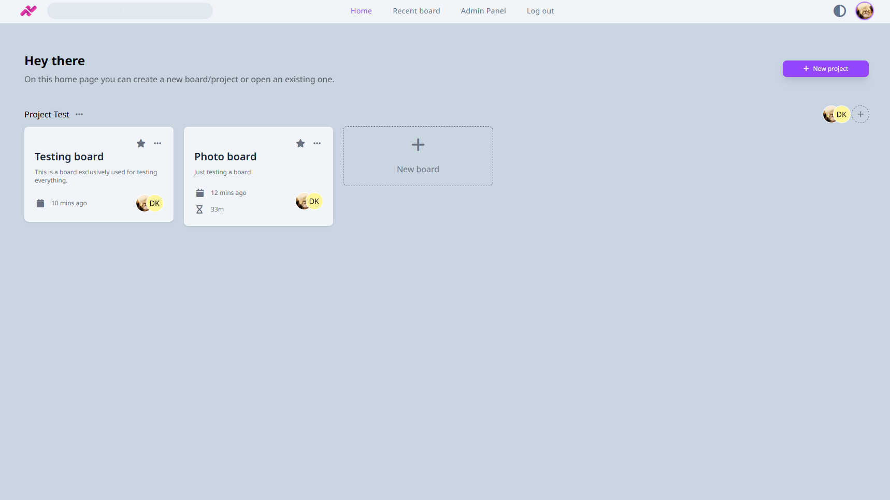
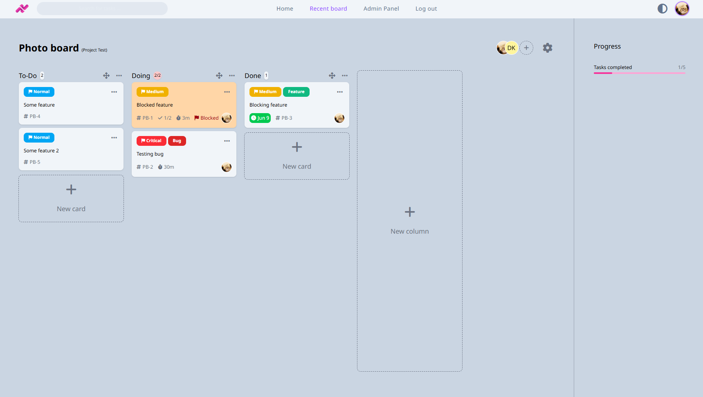
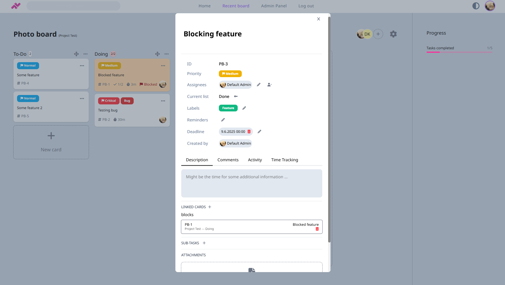
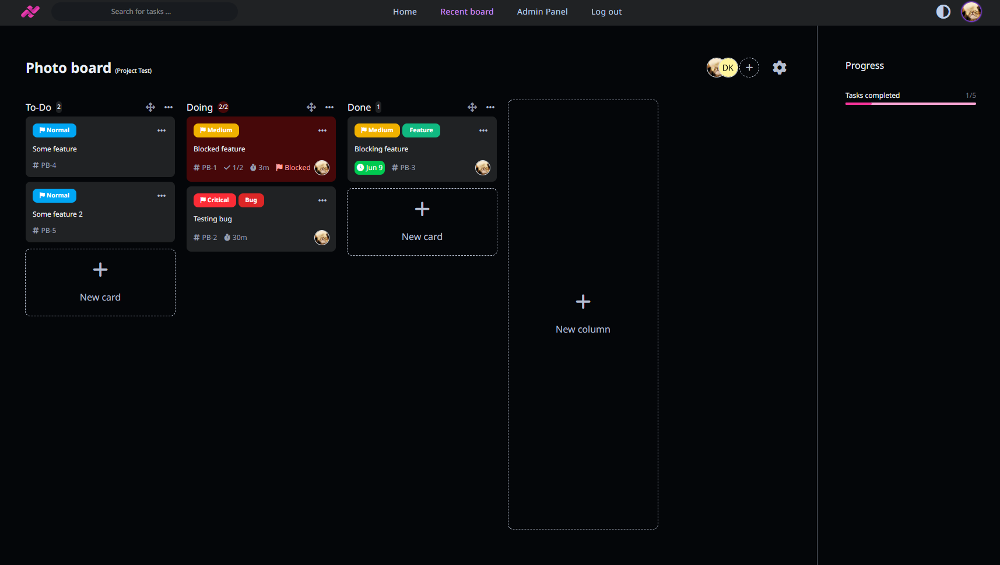

<p align="center">
    
</p>

# Ticky

Ticky is a modern, feature-rich task management system with Kanban-style boards, built using ASP.NET Core Blazor. It is designed to help you manage your projects and tasks efficiently, whether for personal use or team collaboration. Ticky is fully open-source and free to use (and will always be), with a focus on simplicity and usability.

## ❓ The why

You might be thinking, "Another Kanban app?" and that's fair! As someone who navigated between Trello for personal tasks and commercial projects, and Jira at work, I often found myself searching endlessly for "power-ups" that eventually turned into paid features, or trying open-source solutions that didn't quite hit the mark on what I needed or simply lacked the right feel. Ticky was born from that experience - a desire to build something truly comprehensive, intuitive, and always accessible. It's my answer to those frustrations, and it means Ticky will always be free and fully open-source.

## 🌟 Features

Ticky is packed with powerful features designed to make your task management seamless and enjoyable:

- **Projects**: Create and manage projects to group your boards.
- **Boards**: Create and manage your own Kanban boards. You can even make them favorites to stay atop the list.
- **Columns**: Each board can have any amount of columns, all of which are collapsible. You can specify a max card limit, automatically mark the cards within the column as finished and automatically order them.
- **Cards**: Create, edit, and move task cards between columns with drag-and-drop functionality. At a glance see all important information about a card.
- **Subtasks**: Break down tasks into smaller, manageable subtasks with completion tracking.
- **Deadline Management**: Set and track deadlines with color-coded indicators.
- **Time Tracking**: Track time spent on tasks with built-in timer functionality.
- **Labels and Priorities**: Organize tasks with custom labels and priority levels. Label colors are fully customizable.
- **Attachments**: Upload and manage files associated with tasks.
- **Reminders**: Set email reminders for tasks.
- **Task Linking**: Link related tasks together (Jira-like).
- **Activity Tracking**: Monitor all changes and activities on tasks.
- **Comments**: Leave comments on cards to discuss and provide other useful information.
- **User Management**: You can add users on the project level or on the board level, choosing between a Member and an Admin role.
- **Admin Panel**: For creating, editing and deleting users as an admin. Mostly for when not using SMTP.
- **Email Notifications**: Receive notifications for deadlines, and reminders.
- **Progress**: Track your progress within a board by seeing how many tasks have already been completed.
- **App-wide Search**: Find cards from other boards based on their unique identificator (like TEST-1), jump directly to them.
- **Recent board**: Immediately go back to your most recent board.
- **Auto-generated avatars**: To make things more colorful.
- **Able to do fully offline**: Ability to run fully offline, disabling the avatar service, having all the files bundled on the server and not using SMTP.
- **Dark Mode**: A sleek dark mode for less strain on your eyes.
- ... and more!

### 📝 Planned features

I'm constantly working to make Ticky even better! Here's a glimpse of what's in my plans:

- Snooze cards
- Repeat cards
- Mobile version
- Real-time updates
- Swimlanes

## 📋 Prerequisites

- Docker Compose
- SMTP Server for email notifications

## 🚀 Getting Started

### Using Docker (Recommended)

1. Create a `docker-compose.yaml` file, if you'd like to skip SMTP, either use `SMTP_ENABLED=false` or comment out the SMTP section of the environment variables:

```yaml
services:
  ticky-app:
    image: ghcr.io/dkorecko/ticky:latest # or pin to a specific version (like v1.0.0) for manual updates
    container_name: ticky-app
    ports:
      - "4088:8080"
    restart: unless-stopped
    volumes:
      - ./data/app/uploaded:/app/wwwroot/uploaded
    environment:
      - DB_HOST=ticky-db
      - DB_NAME=ticky # Database name, can be customized
      - DB_USERNAME=ticky # Database username, can be customized
      - DB_PASSWORD=your-secure-password
      #- FULLY_OFFLINE=true # Uncomment this if you want to disable the avatar service and run fully offline.
      - SMTP_ENABLED=true # Change this to false to ignore SMTP configuration and disable SMTP setup. Resetting password via typical password reset won't work (will need to be reset by an admin via the Admin Panel), as well as reminders and notifications. Can be enabled at any time.
      - SMTP_HOST=your-smtp-host
      - SMTP_PORT=your-smtp-port
      - SMTP_DISPLAY_NAME=Ticky
      - SMTP_EMAIL=your-email@example.com
      - SMTP_USERNAME=your-smtp-username
      - SMTP_PASSWORD=your-smtp-password
      - SMTP_SECURITY=true
    depends_on:
      ticky-db:
        condition: service_healthy
  ticky-db:
    image: mysql:8
    container_name: ticky-db
    restart: unless-stopped
    environment:
      MYSQL_DATABASE: ticky # This should match DB_NAME in ticky-app container
      MYSQL_USER: ticky # This should match DB_USERNAME in ticky-app container
      MYSQL_ROOT_PASSWORD: your-secure-password
      MYSQL_PASSWORD: your-secure-password # This should match DB_PASSWORD
    healthcheck:
      test: ["CMD", "mysqladmin", "ping", "-h", "localhost"]
      timeout: 2s
      retries: 30
    volumes:
      - ./data/mysql:/var/lib/mysql
```

2. Fill out environment variables within the `docker-compose.yaml` file, `your-secure-password` must be the same between `MYSQL_PASSWORD` and `DB_PASSWORD`. Also make sure that `MYSQL_DATABASE` matches `DB_NAME` and `MYSQL_USER` matches `DB_USERNAME`.

3. Run with Docker Compose:

   ```
   docker-compose up -d
   ```

4. Access the application at: `http://localhost:4088`. Then, you can log in to the default admin account with `admin@ticky.com` and password `abc123`. You will be prompted to change these right away (after changing, the app will log you out, so just use your new credentials to log in). Depending on whether you enabled SMTP or not, other users will either be able to create an account themselves (if SMTP is enabled) or you will need to create accounts for them.

### Manual Setup

1. Clone the repository:

   ```
   git clone https://github.com/dkorecko/Ticky.git
   cd Ticky
   ```

2. Set up your environment variables.

3. Run the application:
   ```
   dotnet run --project Ticky.Web/Ticky.Web.csproj
   ```

## 📷 Preview








## 🛠️ Project Structure

- **Ticky.Base**: Core entities, models, and shared components.
- **Ticky.Internal**: Data access, services, and business logic.
- **Ticky.Web**: Blazor web application, UI components, and user interface.

## 🔧 Configuration

### Database Setup

The application automatically applies migrations on startup.

## 🧪 Development

### Building

```
dotnet build
```

### Running Tests

```
dotnet test
```

### Watch Mode

```
dotnet watch
```

## 🔄 CI/CD

The project includes GitHub Actions workflows for CI/CD:

- Automated builds and tests on pull requests
- Docker image publishing to GitHub Container Registry (GHCR) on releases

## 📝 Contributing

Contributions are welcome! See the [CONTRIBUTING.md](CONTRIBUTING.md) file for details.

## 📄 License

This project is licensed under the MIT License - see the [LICENSE](LICENSE) file for details.

## 👏 Acknowledgements

- [Blazor](https://dotnet.microsoft.com/apps/aspnet/web-apps/blazor) - Web framework used
- [Entity Framework Core](https://docs.microsoft.com/en-us/ef/core/) - ORM used
- [TailwindCSS](https://tailwindcss.com/) - CSS framework
- [Font Awesome](https://fontawesome.com/) - Icons
- [Sortable.js](https://github.com/SortableJS/Sortable) - Drag-and-drop functionality

## 📞 Contact

Have questions or feedback? I'd love to hear from you! Please feel free to open an issue on this repository.

---

Made with ❤️
